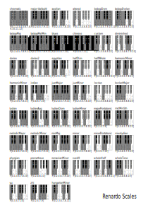

### Skala

Eine Tonleiter oder Skala ist technisch definiert eine Folge von auf- oder absteigenden Einheitstönen, die eine Palette von Noten bilden, die verwendet werden können, um eine Melodie zu bilden. Die meisten Tonleitern in der westlichen Musik entsprechen einer bestimmten Tonart. Das heißt, eine Sequenz von Noten, die standardmäßig Dur oder Moll ist. Dies trifft nicht fuer die chromatische Tonleiter zu, welche eine Tonleiter aller möglichen Halbtonschritte der westlichen Musik ist. Auch die Ganztonleiter ist eine Tonleiter, die aus Intervallen besteht, welche zwei Halbtöne voneinander entfernt sind.

Innerhalb einer bestimmten Tonart gibt es 7 Noten in einer einzelnen Oktave, bevor die 8. Note erreicht wird, die den gleichen Namen wie die erste Note hat und die doppelte Frequenz hat. Die sieben Noten haben unterschiedliche Intervalle zwischen benachbarten Noten. Manchmal ist es ein Halbton (Halbton), manchmal ein ganzer Ton (zwei Halbtöne). Das Muster der Ganzton-/Halbtonintervalle, die die Noten einer Tonart bestimmen, beginnend mit der Note, während die Tonart benannt ist, ist ganz-ganz-halb-ganz-ganz-ganz-halb. Innerhalb einer einzelnen Tonart könnte jede dieser sieben Noten als Grundnote einer aufsteigenden Sequenz verwendet werden. Jede solche Sequenz, die erstellt wird, indem mit einer anderen Note in der Tonart begonnen wird, ist ein Modus dieser Tonart, und jeder Modus hat einen Namen. Zum Beispiel:

***W >> Vollton (Whole)***
***H >> Halbton (Half)***

* Ionian - beginnt mit dem "Tonikum"; die Note, für die der Schlüssel benannt ist. In der Tonart C beginnt der Ionische Modus mit C. Dieser Modus ist der gebräuchlichste und wird umgangssprachlich als "Dur-Tonleiter" bezeichnet. Das Muster ist WWHWWWH.
* Dorian - beginnt mit der nächsten Note höher in der Tonart als die Tonika (D, in der Tonart C). WHWWWHW.
* Phrygian - beginnt mit der Note, die eine große Terz höher als die Tonika (E) ist. HWWWHWW.
* Lydian - beginnt mit der Note, die eine volle Quarte höher ist als die Tonika (F). WWWHWWH.
* Mixolydian - beginnt mit der Note, die eine Quinte höher als die Tonika (G) ist. WWHWWHW.
* Aeolian - beginnt mit der Note eine große Sexte höher als die Tonika (A). In der modernen Musik ist dieser Modus ebenfalls sehr wichtig und wird als "natürliche Moll-Tonleiter" bezeichnet. WHWWHWW.
* Locrian - beginnt mit der Note eine große Septime höher als die Tonika (B). HWWHWWW.
    

---
### Skalentabelle

<!--  -->


---
### Benutze Skalen


* Eine Skala ist im Wesentlichen eine Teilmenge der Noten (Tonhöhen) zwischen einer Note, z.B. C und das gleiche eine Oktave höher.
* Die Startnote ist der Schlüssel der Skala.
* Ab C sind diese Noten:

| C | C# | D | D# | E | F | F# | G | G# | A | A# | B (H) |
|----|----|----|----|----|----|----|----|----|----|----|----|

* Dieser Satz aller Noten wird als chromatische Skala bezeichnet.
* Wenn dies eine Python-Liste namens chromatisch wäre, würde chromatisch [0] C zurückgeben, chromatisch [1] würde C # zurückgeben, chromatisch [2] würde D zurückgeben und so bis chromatisch [11], was B zurückgeben würde.
* Da jede Musikskala eine Teilmenge dieser Tonhöhen ist, können wir uns jede Tonleiter als eine Liste von Indizes für den Zugriff auf Tonhöhen in der chromatischen Skala vorstellen.

chromatic = [C, C#, D, D#, E, F, F#, G, G#, A, A#, B]

| **C**  | **C#** | **D**  | **D#** | **E**  |  **F** | **F#** | **G**  | **G#** | **A**  | **A#** |**B(H)**|
| ------ | ------ | ------ | ------ | ------ | ------ | ------ | ------ | ------ | ------ | ------ | ------ |
|   0    |    1   |    2   |    3   |    4   |    5   |    6   |    7   |    8   |    9   |   10   |   11   |


* Um eine Liste der verfügbaren Skalen anzuzeigen, führe einfach den Befehl print(Scale.names ()) aus.
* Standardmäßig verwendet jeder Spieler eine global zugängliche Standardskala namens Scale.default
* Dies kann auf drei Arten geändert werden:

Ordne die Skala einfach Scale.default zu:
```python
Scale.default = Scale.minor
```

Du kannst auch den Zeichenfolgennamen verwenden:
```python
Scale.default = "minor"
```

Und du kannst die "set"-Methode verwenden, die weitere Optionen ermöglicht:
```python
Scale.default.set("minor")
```

Es ist auch möglich, die Skala der Spieler individuell zu ändern.

Zwinge ein Playerobjekt die Moll-Skala zu verwenden:
```python
p1 >> pluck([0,1,2,3], scale=Scale.minor)
```

---
### Modi

W.I.P

---
### Benutze Modi

W.I.P
