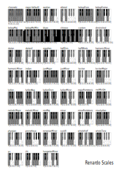

### Scale

A musical scale, or scale, is technically defined as a series of ascending or descending unitary tones that form a range of notes that can be used to form a melody. Most of the scales in Western music correspond to a specific key. That is, a sequence of notes that is major or minor by default. This does not apply to the chromatic scale, which is a scale of all possible semitones in Western music. The whole tone scale is also a scale that consists of intervals that are two semitones apart.

Within a given key there are 7 notes in a single octave before reaching the 8th note, which has the same name as the first note and is twice the frequency. The seven notes have different intervals between adjacent notes. Sometimes it's a semitone (semitone), sometimes it's a whole tone (two semitones). The pattern of whole tone / semitone intervals that determine the notes of a key, starting with the note while the key is named, is whole-whole-half-whole-whole-whole-half. Within a single key, any of these seven notes could be used as the base note of an ascending sequence. Any such sequence created by starting with a different note in the key is a mode of that key, and each mode has a name. For example:

*   Ionian - begins with the "tonic"; the note for which the clef is named. In the key of C, the Ionic mode begins with C. This mode is the most common and is colloquially referred to as the "major scale". The pattern is WWHWWWH.
    
*   Dorian - starts with the next note higher in key than the tonic (D, in the key of C). WHWWWHW.
    
*   Phrygian - starts with the note that is a major third higher than the tonic (E). HWWWHWW.
    
*   Lydian - begins with the note that is a full fourth higher than the tonic (F). WWWHWWH.
    
*   Mixolydian - starts on the note that is a fifth higher than the tonic (G). WWHWWHW.
    
*   Aeolian - begins with the note a major sixth higher than the tonic (A). This mode is also very important in modern music and is known as the "natural minor scale". WHWWHWW.
    
*   Locrian - begins with the note a major seventh higher than the tonic (Bb). HWWHWWW.
    

---
### Scales table

<!--  -->

---
### Using Scale


*   A scale is essentially a subset of the musical notes (pitches) between one note, e.g. C, and the same one an octave higher.
    
*   The starting note is the key of the scale.
    
*   Starting at C, these notes are:
    
*   This set of all the notes is called the chromatic scale.
    
*   If this was a Python list called chromatic, then chromatic[0] would return C, chromatic[1] would return C#, chromatic[2] would return D, and so until chromatic[11], which would return B.
    
*   Because each musical scale is a subset of these pitches, we can think of each scale as a list of indices for accessing pitches in the chromatic scale.
    

chromatic = [C, C#, D, D#, E, F, F#, G, G#, A, A#, B]

| **C**  | **C#** | **D**  | **D#** | **E**  |  **F** | **F#** | **G**  | **G#** | **A**  | **A#** |**B(H)**|
| ------ | ------ | ------ | ------ | ------ | ------ | ------ | ------ | ------ | ------ | ------ | ------ |
|   0    |    1   |    2   |    3   |    4   |    5   |    6   |    7   |    8   |    9   |   10   |   11   |


*   To see a list of the scales available just run command print(Scale.names()).
    
*   By default, each player uses a globally accessibly default scale called Scale.default
    
*   This can be changed in 3 ways:
    

Simply assigning the scale object to Scale.default:
```python
Scale.default = Scale.minor
```

You can use the string name:
```python
Scale.default = "minor"
```

You can also use the "set" method, which allows more options:
```python
Scale.default.set("minor")
```

It is also possible to change the scale of players individually.

Force a player to use the minor scale:
```python
p1 >> pluck([0,1,2,3], scale=Scale.minor)
```


---
### Modes

W.I.P

---
### Using Modes

W.I.P